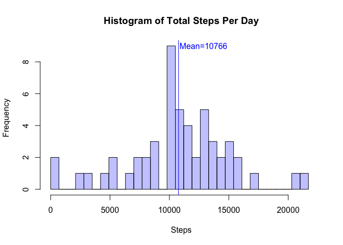
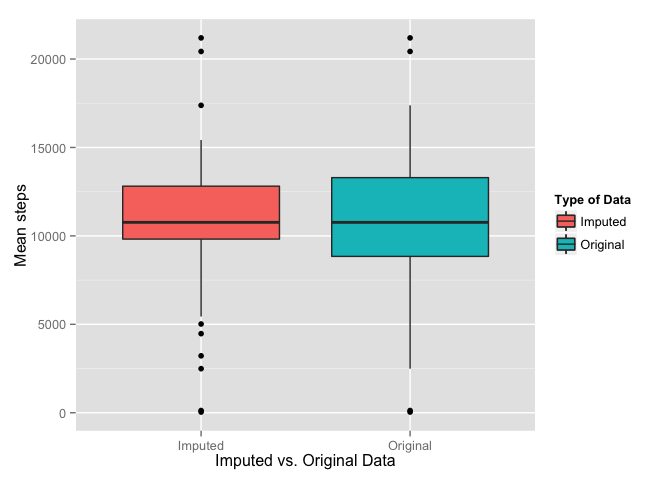
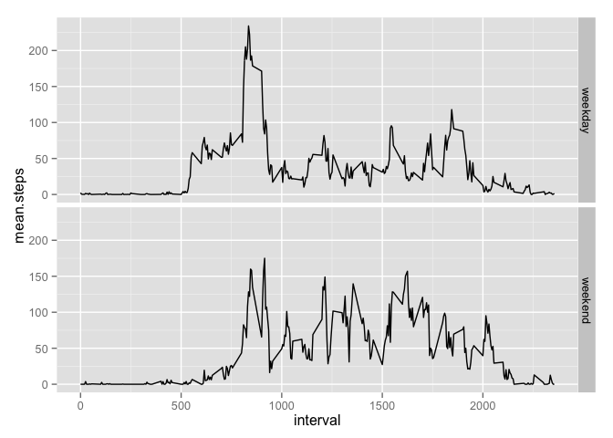

# Reproducible Research: Peer Assessment 1


## Loading and preprocessing the data

```r
#
# Load packages used in the analysis
require(plyr)
```

```
## Loading required package: plyr
```

```r
require(ggplot2)
```

```
## Loading required package: ggplot2
```

```r
#
#Initialze constants
#
xlim <- c(0,22000)
histoBreaks <- seq(from=0, to=max(xlim), by=700)
blueTransparent <-rgb(0,0,1,1/4)
redTransparent <-rgb(1,0,0,1/4)
#
#Initialze locations of data
#
projectDataURL     <- "https://d396qusza40orc.cloudfront.net/repdata%2Fdata%2Factivity.zip"
projectDataFileZip <- "rep_data_activity.zip"
projectDataFile    <- "activity.csv"
#
# Load Data
#
if (!file.exists(projectDataFileZip)) 
  { 
    download.file(projectDataURL, projectDataFileZip , method="curl")
  }
if (!file.exists(projectDataFile))    
  { 
    unzip(projectDataFileZip) 
  }  
df <- read.csv(projectDataFile)
#
# create a clean data set without the "NA"s
#
cleanData <- df[complete.cases(df),]
```

The data for this report was downloaded from the [course repository](https://d396qusza40orc.cloudfront.net/repdata%2Fdata%2Factivity.zip) on Mon Aug 11 12:18:37 2014

## What is mean total number of steps taken per day?

To address this question, we use ddply to sum the steps by date and then calculate the mean and mediam total steps per  day.


```r
stepsPerDay <- ddply(cleanData, .(date),summarise, steps=sum(steps, na.rm=TRUE))
meanSteps <- mean(stepsPerDay$steps)
medianSteps <- median(stepsPerDay$steps )
```

The mean number of steps per day is 10766.   The median number of steps per day is 10765.

The following is a histogram of the total steps per day.


```r
hist( stepsPerDay$steps, col=blueTransparent, xlim=xlim,xlab="Steps", 
      main="Histogram of Total Steps Per Day",breaks=histoBreaks)
abline(v=meanSteps, col="blue")
text(meanSteps+2100, 9,  sprintf("Mean=%5.0f", meanSteps),col="blue")
```

 


## What is the average daily activity pattern?
The following is a time series plot of the mean number of steps for each 5 minute interval in a day.


```r
#
# Using ddply, calculate the mean number of steps per each interval.
#
activityByInterval <- ddply(cleanData, .(interval),summarise, mean.steps=mean(steps, na.rm=TRUE)) 
#
#
plot(activityByInterval$interval, activityByInterval$mean.steps, type="l",xlab="Interval", ylab="Mean Steps", main="Daily Activity Pattern")
#
#find the max steps for all intervals
#
maxAvgSteps     <- max(activityByInterval$mean.steps)
#
# find the interval with the max value
#
intervalWithMax <- activityByInterval[activityByInterval$mean.steps==maxAvgSteps,"interval"]
#
# convert the interval to a time just for grins.
#
maxTime         <- sprintf("%2d:%2d",floor(intervalWithMax/60), intervalWithMax%%60 )
#
#Add a vertical line and text for the max
#
abline(v=intervalWithMax, col="blue")
text(intervalWithMax+350,maxAvgSteps,sprintf("Max at interval %d at %s",intervalWithMax,maxTime), col="blue")
```

 

To calculate the maximum interval, I found the maximum value for all intervals and then found the interval that had this maximum value.
The maximum # of avg steps for all intervals is   206 in interval   835

## Imputing missing values

```r
#
# count number number of missing values in the dataset
#
missingValues <- sum(is.na(df$steps))
```

In the original dataset, there are 2304 missing i.e. NA values.

To impute the data set, I chose to replace "NA" values with the mean values for the interval for the null value.  The rationale for this is that activity for a time of day should be fairly consistent across days.


```r
#
# Copy the original dataframe to a new data frame that will hold the imputed dataset
#
imputedDF <- df
#
# The meanStepsForInterval function returns the mean steps for the interval passed in the argument.
#
meanStepsForInterval <- function(interval)
{
  meanStepsForInterval <- activityByInterval[activityByInterval$interval==interval,"mean.steps"]
}

#
# Loop through all the rows in the dataset and replace with the mean for that interval
#
for (i in 1:nrow(imputedDF))
{
  if (is.na(imputedDF[i,"steps"]))
    {    
      imputedDF[i,"steps"] <-meanStepsForInterval(imputedDF[i,"interval"])
    }
}
imputedStepsPerDay <- aggregate(steps~date, data=imputedDF, FUN=sum)
meanImputedSteps <- mean(imputedStepsPerDay$steps)
medianImputedSteps <- median(imputedStepsPerDay$steps )
compareImputed <- merge(imputedStepsPerDay, stepsPerDay, by="date", all=TRUE)
```

The mean steps per day of the source data is 10766 and the mean of the imputed steps per days is 10766. The median steps per day of the source data is 10765 and the mean of the imputed steps per days is 10766. The impact to the overall mean and median was neglible; however, the distribution was altered because there are more days which centered around the means shown below. 


```r
ggplot(compareImputed, aes(x="Imputed", y=steps.x, fill="Imputed")) + 
  geom_boxplot() + 
  geom_boxplot(aes(x="Original", y=steps.y, fill="Original")) +
  xlab("Imputed vs. Original Data") +
  ylab("Mean steps") +
  scale_fill_discrete("Type of Data")
```

```
## Warning: Removed 8 rows containing non-finite values (stat_boxplot).
```

 

## Are there differences in activity patterns between weekdays and weekends?

In looking at the plots of the average activity levels for weekday and weekend activties, weekday activity begins earlier in the day; but; weekend activity is higher later in the day as show below.


```r
#
#create a factor variable to indicate if the day is a weekend
#
cleanData$typeOfDay <- as.factor(ifelse(weekdays(as.Date(cleanData$date))  %in% c('Sunday','Saturday'),"weekend", "weekday"))
#
# calculate the mean by intervale and type of day
#
intervalActivity <- ddply(cleanData, .(interval,typeOfDay),summarise, mean.steps=mean(steps, na.rm=TRUE)) 
#
# plot interval activity with separate facets for each type of day i.e. weekend or weekday
#
ggplot(intervalActivity,aes(x=interval, y=mean.steps) )+geom_line()+facet_grid(typeOfDay ~.)
```

 
